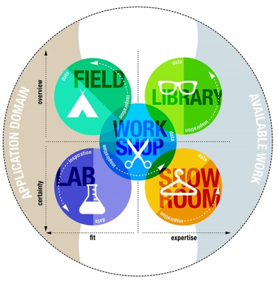
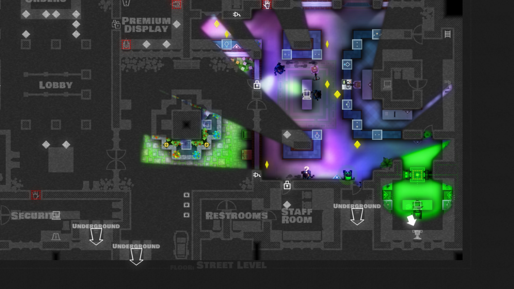

# System based stealth assets

This document will attempt to explain how the project will be implemented
within the context of Unity.
A minimal amount of knowledge of the Unity components is needed and no code
will be shown during this example.

## Included and excluded systems

To make sure this project is doable within the given timeframe, it is time to look
at what systems not to include within the system.

To start off, lets focus on the player, the first mechanic a developer would need
to implement is the camera and movement system of the player character.
This is something I will intend to leave at the developers implementation as this
varies a lot on a game by game basis.

The main focus of the project is on the guard AI and developing tools around it.
How would I implement an interface for being searching, being alerted, movement, etc?
How would you make these components and make them expandable for the developer without
them having to even open your source code?
How could I make the game play itself?

## Research and design possibilities

There are a ton of research possibilities available within this concept.
On the first side there is a possibility to look at things from the player side:

- How does a guard communicate where he is going?
- What does the guard think about the current situation?
- What can I get away with at this stage of alert?

There are still a ton of questions like this that can be asked and possibly answered.
The biggest focus I want to have here is on the movement of the guards.
How can a game developer make sure that the player understand where the guard is
going even with just getting a second of sight on the guard?

### Possible research questions

In this section a few research questions will be addressed that could be asked
and lead to interesting results. These questions are noted with the field that
they exist in within the *dot research framework*.

- How have existing games implemented the movement of guards using visuals? *(library)*
- How does the environment and the placement of the guards influence the thoughts
that the player has about the guard? *(lab)*
- Do stationary guards seem smarter to users than moving guards? *(lab)*
- How many movement patterns can a player remember at the same time? *(lab)*
- What are the most common complaints users have about guards in stealth games? *(library/field)*

### Design possibilities

In this section it will be discussed what could be designed ahead of developing this
project.

As discussed with both Jack (the teacher) and Bas (a student) the guards will
most likely use a state machine to perform actions under different conditions
and states of alert. There are multiple products that already do this for the developer
which could be used.
I would like to at least understand, design and implement the state machine myself
as a learning experience, even if this is not used afterwards.

The following image is an example state machine taken from google.

Furthermore it will be important to work modularly and component based within
Unity itself. Developers should be able to expand the AI and systems themselves
and should not be limited to a type of movement because how I programmed my system.

## End product

The end product of this project will be multiple gameplay systems that work
together to create one first person stealth game.

These are the scripts I expect to be developed within this project:

### Guard AI

The AI and statemachine that drives the guard to perform actions.
These actions (movement, attack, etc) can be specified by the developer.

### Suspicious object

Defines a specific object, how much alert it gives and how long it takes for
a guard to inspect the object.

This script can be put on objects like cans that a player can throw at the enemy,
the player themselves, guns or things the player can interact with.

### Simple detection

A simple form of detection that the guards can do to spot objects.
This should be replaceable by the developer but I want to at least supply a default.

### Global settings

Modifiers that guards' statistics get to make the gameplay more and less difficult.
This also should allow the developer to easily implement difficult and an assist mode.

## The game

To show that the concept is worthy of the time spent on it, it will be implemented
into a game that will be played in user tests.

The game will be a third person stealth game where the player has to reach the
goal as shown by a simple camera shot.
In their way, the player will find the guards patrolling the area.
The player will be able to deceive and avoid these guards or if needed, eliminate.

There will be a top down camera in the style of *Hotline Miami* or *Monaco*.

This will allow the player to see the guards more easily and observe their patterns.
The realism goes down because of this camera angle but when executed well, that is
not an issue.

To mimic the mechanics found in Dishonored 2 (the blink ability) we'll give the
player a grapling hook. This allows them to have high speed and move by guards quickly.

The player will also be able to eliminate guards or find disguises laying around.
This will help deceive guards and move more easily.

## Indicators

In this chapter I'll discuss how I will prove that my game is interesting and
that I've made an interesting stealth pack for the player.

### User Testing

The product will continuously be user tested. This first happened with a paper
prototype where I looked at how players predicted the paths of guards with
and without guidelines.
This will continue to a point where we set up 2 scenarios for different players
and ask the players how smart the AI felt.
This just tests how players feel the difficulty is in terms of the guards.
When the guards have less give-aways and spot objects more easily, the player might
find them smarter. This works till the turning point where players will find
the guards too difficult and see them as unfair rather than smart.

There will also be looked at how well the player does at navigating the level
and around the guards. Both by recorded gameplay and actual observing.
The player does not get hints unless fully stuck and observations will not be
mentioned towards the player before the experiment ends.
In this way it can be checked that the found solution and analysed games/mechanics
actually work in the implemented prototype.

# STILL IN PROGRESS
