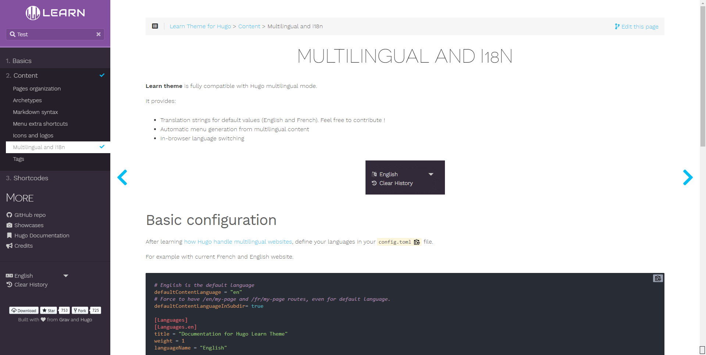
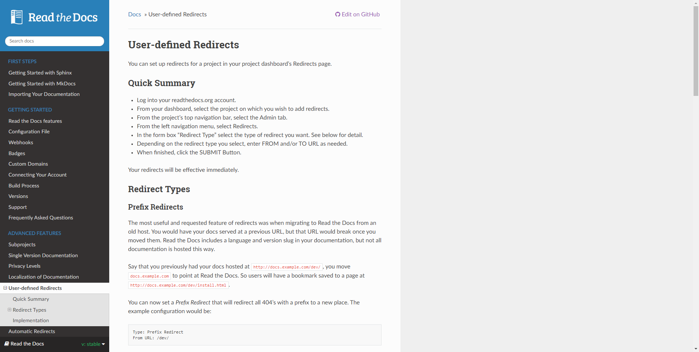
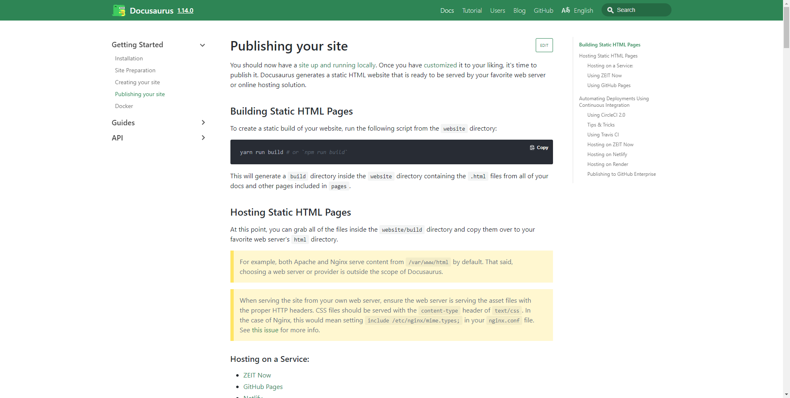

To document the asset pack in a way that developers can work with it, a tool is
needed that is able to generate a static website with documentation.
This documentation will be custom written.
The following document will go over the decision of what tool to use.

## Requirements

To find the correct tool for the job, I've decided to first set requirements.
These requirements are ranked with the most important requirement coming first.

### Markdown support

The documentation tool would ideally use the Markdown formatting syntax.
This is a syntax I am comfortable with and allows me to write formatted documents with ease.

### C# syntax support

Unity uses C# so the syntax highlighting support is rather important. This makes
sure that code examples and guides are easily readable.

### Open Source

As I am also making this package an open source project and am generally in favour
of the open source community, I'd like the documenting tool to be open source.

### Navigation

Finding the right article is one of the most important parts of the documentation.
The tool should generate a page that can be easily navigated by the user and it's
clear where specific articles live. A search function would also be helpfull.

### Hosting

What is documentation worth if it can not be hosted anywhere. Having an easy way
to publish and host the documentation on a normal HTTP server would be a big plus.

## Research into the tools

For this research I've decided to go with 3 contenders that are the best known to
me and that I have the most interest in. Be it from working with them from a developer
standpoint or writing in them before.

### Hugo

Hugo is the application I already use for making the portfolio.
It does feature some templates for writing code documentation.
Navigation of the "Learn" theme is done well, there are main and sub sections.
The pages are noted down in a familiar way.
Hugo is fully open source, uses Markdown and features C# syntax highlighting.
Hosting hugo is also very easy as it outputs to HTML.
Hugo uses their own CLI and runtime.

### Read the Docs

ReadTheDocs is one of the more older tools used to document tools.
It features Markdown but it is not the main way of editing text.
The navigation works in the way of having the sidebar dedicated towards sections
and subsections. Yet with their documentation I find it to be
very busy and impractical to use. This tool uses pip and Sphinx, two unfamiliar tools to me.

### Docusaurus

Documentation tool made by Facebook, uses Markdown to write all pages and
so naturally supports C# syntax highlighting.
It uses the npm workspace, which I am familiar with.
Deployment is done by generating the static html.
Navigation is superb with the greatly themed search box and clean navigation to the side.

## Matrix

| Name          | Markdown support | C# Syntax highlight | Open Source | Navigation (1/10) | Hosting ability (1/10) |
|---------------|------------------|---------------------|-------------|-------------------|------------------------|
| Hugo          | Yes              | Yes                 | Yes         | 8                 | 10                     |
| Read the Docs | Yes              | Yes                 | Yes         | 8                 | 10                     |
| Docusaurus    | Yes              | Yes                 | Yes         | 9                 | 10                     |

As it turns out, most of these tools already met the requirements I set out to have.
Docusaurus has a bit of a more modern look which I personally am a fan of.
It is also uses tools I already am familiar with and is used by the industry.

Because of the reasons stated above, I will go with **Docusaurus**.
