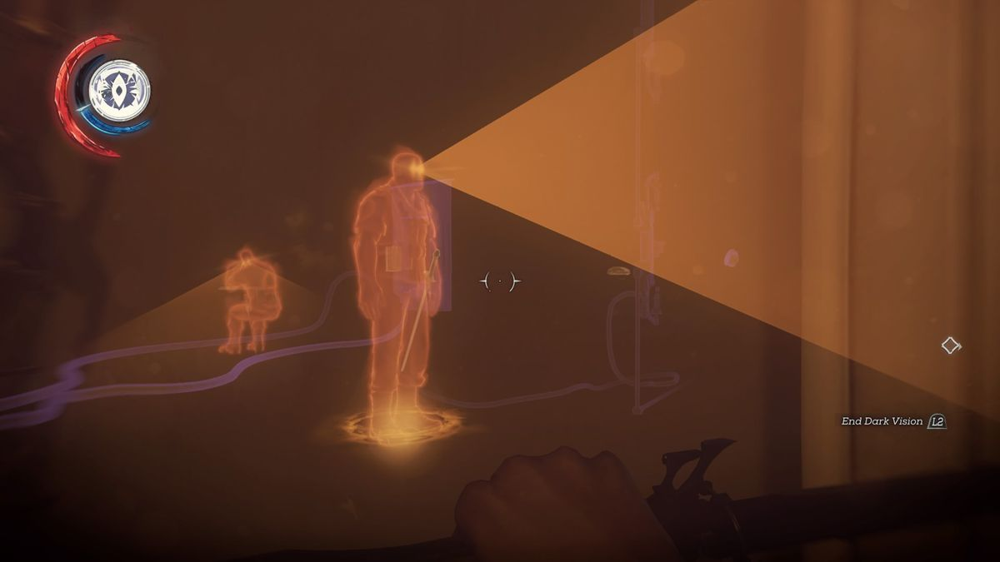
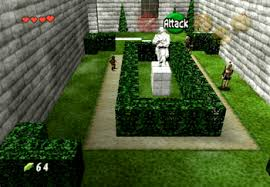
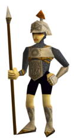
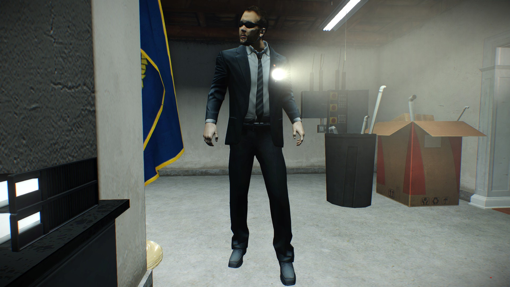
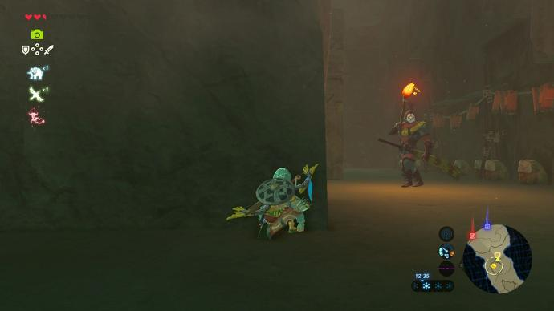
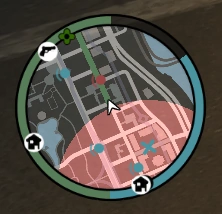
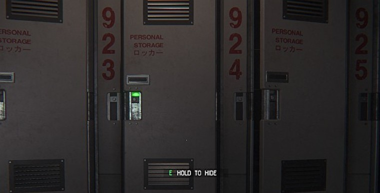
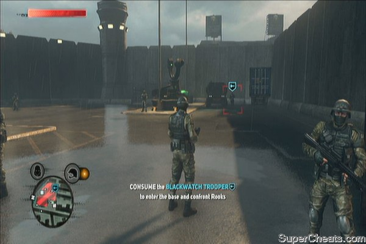
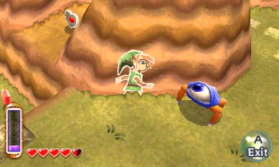

# Guard AI system

The idea is to make an guard AI that is fun, fair and intuitive.
These 3 aspects are the most important and will be further explored within this
document.

- [Guard AI system](#guard-ai-system)
  - [What is guard AI](#what-is-guard-ai)
  - [Intuitive](#intuitive)
  - [Fair](#fair)
  - [Fun](#fun)
  - [Designing challenges](#designing-challenges)
    - [Alert level and resolving the situation](#alert-level-and-resolving-the-situation)
      - [My solution](#my-solution)

## What is guard AI

The term Guard AI will be constantly used further in this document.
Within this chapter, the term will be explained.

With Guard AI, the NPC characters that keep watch over a certain objective.
The objective of the player should be to sneak by the guard and go undetected.
With Guard AI the following mechanics are included:

- Communication between the guards
- What the guard sees
- What the guard hears
- What the guard smells
- How the guard reacts when seeing a suspicious action on different alert levels.
- The movement of the guard
- How the alert level can be lowered

## Intuitive

Guard AI should be intuitive and understandable to the player.
The player should have a clear understanding of what the guard is seeing at
times and shouldn't feel cheated when a guard spotted him/her.
These guards should have realistic reactions and realistic walking patterns.

From the context of the room and the movement of the guard it should be possible
to understand where the guard is going at all times.

A good example of this is *The Legend of Zelda: Ocarina of Time*.

The layout of the building makes it clear that the guard is moving in a square
around the hedges.
The player now understands that he as to wait until there is no guard in his path.
There is also a distinct feature on the guard himself. The spear always points
to the direction he is facing and where he is going.

In this way even the children could get past these guards without much of an issue.
Of course Nintendo didn't introduce the guard in a complex situation that takes
time to evaluate. The learning principle is present and should be enacted.

Start with an easy guard that is easy to move past but gives you an understanding
of how their mechanics work. This great design has made for one of the most
memorable "stealth" section in video games for me.

> How do more modern games make use of this?

To answer this question lets look at one critically acclaimed stealth and heist game
*PAYDAY 2*.
In this game the guards move in observable patterns, they don't simply move around
in a square or circle but rather have a set path that they go for.
There are some free-roaming guards but for the sake of simplicity, lets not mention these.

Now for the direction they are moving in, *PAYDAY 2* has an extra challenge to it,
it is a First person game.
Meaning if a guard comes from behind, they have no idea if their spear is pointing forwards.
In this case the Swedish game developer decided to use **flashlights** as an alternative.
Most *PAYDAY 2* stealth maps are in the dark, meaning the light coming from the
guard is viewable even when not in direct sight of the guard.
It also gives a distinct indication into which way the guard is moving.

The positive effect for *PAYDAY 2* that is also added here is the option
to see where the guard is looking and if it's able to spot you.
In the light, means I'm seen.

I want to focus on what was swiftly said before.
**Predictability**, a guard's behaviour should be understandable and predictable
by the player. The player should be able to understand where the guard is going
at nearly every point in the gameplay proces.
This doesn't have to happen instantly, the player can make a mental map of
the area and the guards in it by observing their movement.

This is one of the reasons why stealth games offer a lot of vertical ground
as well. The player can observe guards better from high up than they can from the ground.
This is mostly notable in *PAYDAY 2*'s Shadow Raid and *Dishonoured*.
These games feature guards that have more complex paths.
The player is allowed time and safety to observe these guards and figure out how
this level works.

The predictability also has to flow further into the actions that the AI takes.
In *PAYDAY 2* and *Hitman* will first try a passive approach if you are found
trespassing. They will point their gun at you and tell you to surrender, arresting
you if you comply.
If you do not comply both will start to figure and start a chain reaction of
alerting other guards, would it be through an alarm or the gun making noises.

## Fair

A guard must have distinct characteristics and must not randomly change these.
If we take *Thief (remastered)* as an example. It is explained that hiding
in the shadows makes you be able to be safe from the vision from guards.
You even get an indicator if you are able to be seen or better said how
**immersed** in the darkness you are. If a guard would randomly see you in the
dark and call you out, the player would feel cheated.
This can be used as a story point and would be interesting as one but this is not
the point of this document.

If the player can not understand the guard's actions and can not predict the guard
he might turn to brute forcing or playing too carefully.
There is a need to force the correct playstyle to the player and give the player
safe moments and moments of fear in going around the guards.
This is relevant to the AI, if an arm from the player has been spotted not all of
the AIs should instantly move towards their position.

There is the need for an **alert level** like seen in games like *Metal Gear Solid*.
Guards should feel the need to investigate sounds and visions when they are a
little bit on alert but the entire army should only be sent after you when the
alert level is high enough.

*Metal Gear Solid V: The Phantom Pain* does this in a immersive way, the alert
levels get called out over the radio. Along with this, the actions taken are also called out.
This makes it some, while the player still feels a rush of panic, the player
feels in full control of the situation and gets the situation displayed in an
in-world method.

## Fun

In the end of the day, people play video games for fun and satisfaction.
That last point is where guard AI should help out.
It should be satisfying for a person to pass the guards in question.
Basically saying, a heated situation should not resolve itself automatically.

In my personal experience and opinion, having an automatic failure when
the player gets detected is a bad experience.
For it to be done well, the checkpoints within the level should be indicated well
and be frequent enough based on for example difficulty.

A bad example of this is *The Legend of Zelda: Breath of the Wild* and *Metal Gear Rising: Revengance*.

While I both love these titles, the stealth sections are a pain.
The player is basically forced to do these sections in one go within a game that
does not have stealth as its core mechanic. Meaning if you do not understand
the guard, you will have a bad experience and feel frustrated.

Another game that implements stealth as a gimmick is *Astral Chain*.
This is (at the time of writing) the latest spectical fighter released by Platinum Games.
(For reference, these are the same develop as *Metal Gear Rising*).
In this game there is a stealth section that last for about 10-15 minutes.
It is no that well made as at this point it could be difficult to control your
character in a stealthy way, crouch is the same was as sprint, to summon your
helper you press the attack button. Yet this stealth experience is redeemed by the
checkpoint system. With every minor step that you continue, there is a checkpoint.

This means while the immersion of the player is less present as you are not thrown
out of the building when caught but just reset to a certain point, the entire
experience is delivered in such a way that it feels good and non-frustrating.

## Designing challenges

This chapter will descript the design challenges that will be faced when designing
this AI and game.

### Alert level and resolving the situation

If we look at games that implement an alert level like *Metal Gear Solid*, *GTA* and *Hitman*.
These systems either go for slow decay of the alert or an instant switch.
It takes time for the guards to "forget" about you and move on with their life.
Even if *GTA* isn't a stealth game, its not natural for the police to just give
up a chase or stop searching but it makes the gameplay fun and rewarding.

In stealth games this can work in a different way, camping.
Lets look at *GTA 4* against a game like *Hitman*. In *GTA 4* there is a detection
circle.

This is basically the scene of the crime and exiting this will result
in your *wanted level* (alert level) getting removed after a period of time.
This circle encourages the player to quickly move and make
potentially violent actions. This is exactly what the game wants.

Now compare this to most stealth games, if your alert level drops slowly.
The default tactic is (kill), run and hide, most often there is
something like a container or locker that the player can hide in.

In a mostly action based game, this means that you are breaking
the action and sitting still.

#### My solution

I want to solve the action killing by making lowering an alert level
interesting, fun and intuitive.

The first idea is come to mind is a *Prototype 2* or *PAYDAY 2* system.
When the guard is killed or alerted, the player can pretend to be the guard
but can only fool the operator a set number of time (difficulty).

In *PAYDAY2* this is the pager system, when a guard is killed, made surrender or
knocked out, the player must answer the pager in time and give an excuse.
There are a few issues with this:

- A stealth kill ALWAYS results in a pager, this means the guard always presses
the pager just before he/she gets killed, unrealistic.
- The voice of the person is obviously the same each time with a little bit of
a higher or lower pitch, unrealistic.

However this mechanic could be combined with another game, *Prototype 2*.
In this game to get out of detection, you will need to consume a NPC and wear
his skin as a disguise.

Now what if we combine these mechanics as shown with Angel in *Borderlands 2*.
Emulate the voice of someone to bypass some sort of security.
We get enough data about a person to disguise as them in a difficult and stressful
situation, maybe with a stressful minigame.
Then we can use his/her voice to pretend to be them and call off the alert.
The body of the person would still be here and with the lack of body bags like
in *PAYDAY 2*. The stress situation persists even after the guard and alert
has been dealt with.

Lets try another thing but more hiding in plane sight.
Lets say the theme of the game is a more cartoon setting.
A way to implement hiding in a fun and in character way could be how *A Link between worlds*
implements the movement system. You could merge with the wall and appear as a painting.
Having to do a form of minigame or action to be able to get of the alert level.

