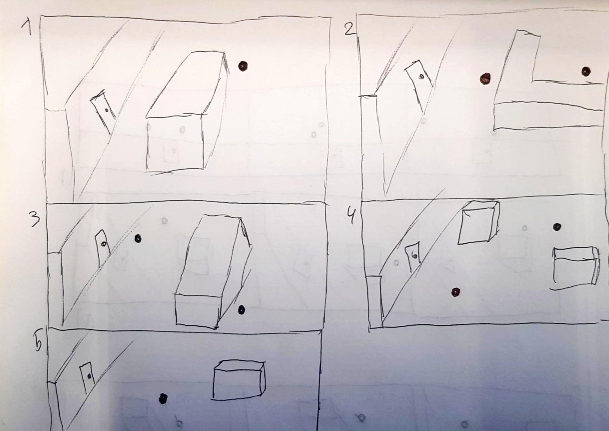
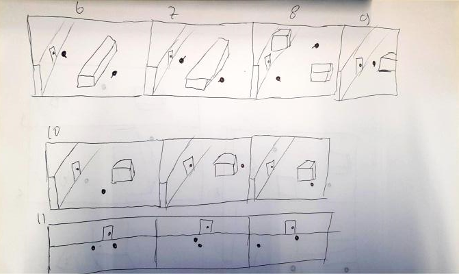

Within the [Guard AI analysis document]()
there is a piece on how player will observe and assume a guards movement pattern
based on the surroundings and the give-aways of the guard. This document also
goes into the importance of predictability. To make sure these assumptions from theory
are correct, a paper prototype has been made an executed.

## The made prototype

The prototype is split into 3 parts, a part where guards have no indication where
they are currently going, one where they do and one where there are 3 frames after
each other.

The user is explained that the door in the wall is the goal and that the back dot
is the guard. All scenes drawn are completely separated from each other and have
no interconnection. It's also explained that a guard can also be standing still.

The player is then asked to describe where the guard is going. No conformation is
given if the player is correct, the player is also asked to further elaborate as
much as possible.

Furthermore 6-7-8-9 have a close to same situation as the previous tests but now
the little stick indicates a flashlight that the guard is holding. The test is
identically executed to the first piece of paper.

Lastly there are 10 and 11, these tests are to see if by capturing snapshots
of the guards position the player can still figure out where the guard's path.

## Observations

The biggest surprise that occurred was a new bit of theory, over half of the players
where also considering the objective as something the guard would move around.
Most judgement with easy cubes and rectangles was correct by most people.
If there were 2 guards there was a split in the players opinions. Either the
players thought that the guards move around the rectangle together or they move
up and down on their side of the cube.

## Take aways

Players are more prone to think a guard will be standing still if the guard is close
enough to the objective. Players have a hard time figuring out movement when it
comes to seeing corners and having completely still images.
Having guards cross paths can be difficult to understand for some players.
