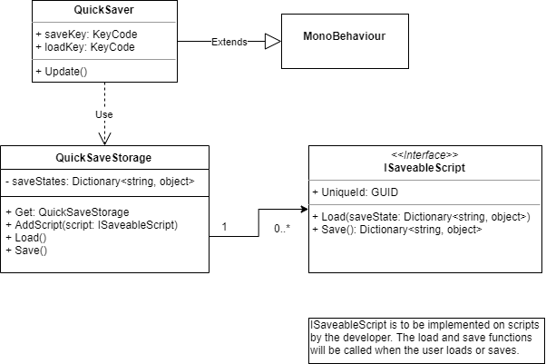

Within my analysis of [Dishonored 2](), I noted the importance of the quick save/load
system. It was essential in making the experience feel good and make mistakes feel
not as bad as it may seem.

Because of this, I've decided I want to implement the quick saving and loading within
the asset pack.

The following is an UML Design of the set in place system.

