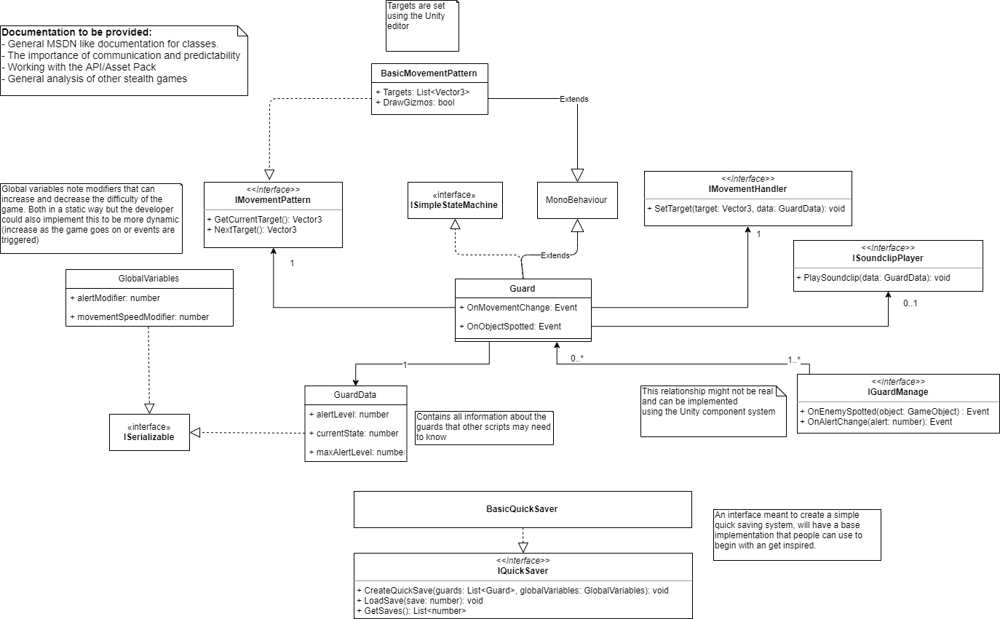
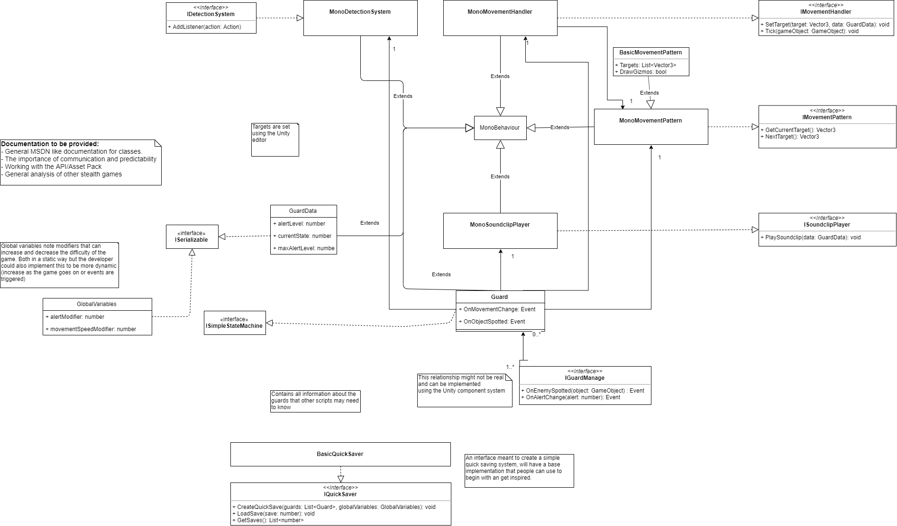

The following document focusses on the design of the reusable asset pack and
how this was iterated with feedback from peers to become the final design.

Peers will be asked to check if they understand the document, find it logical
and provide any improvements that could be done. This feedback will be noted down
in a summarised version within this document. The progress from before and after
the feedback will also be shown within the document. This is to show that the
design is actually **iterative**.

Within this diagram there is also information on what documentation will be
provided to the developer.

## Feedback

Note that the feedback provided may be in Dutch and will be provided by the author
of this document.

### Ruud Schouten 30-9-2019

> Instead of using events, you could use UnityEvents, these are identical to
> events but can be assigned in the Unity Editor.
> see https://forum.unity.com/threads/unityevent-where-have-you-been-all-my-life.321103/.
>
> With this you can change the interfaces to GameObjects and add it to the Guard GameObject.

These pieces of advise are useful, having the events accessible within the Unity Editor
will be much easier on the developer to work with.

On his second point, this is the idea of when the user actually implements this
interface. This means that this is not clear within the design document and should be adjusted.

## Revision 1

This revision was made during the implementation of this model, discovering issues
and feedback from peers on the design.

The most notable change within this design is the addition of the `MonoX` classes.
These implement the interfaces and MonoBehaviour so that it can be added and attached
to by the Unity Editor.
